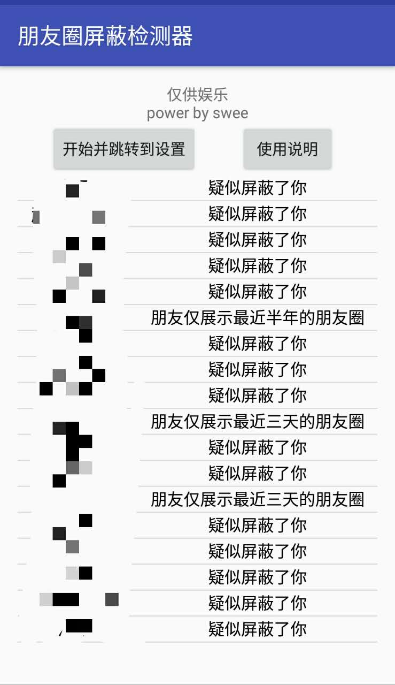

# 朋友圈屏蔽检测器

## 效果展示

## 相关技术
主要利用了AccessibilityService进行监控，然后模拟人类点击行为完成扫描和记录，类似于安卓的爬虫吧。时间关系代码部分没怎么注释，不过也都不难懂，后期尽量补上吧。

如果只是想下一个软件测一下，可以直接下载.apk文件

## 使用说明
1. 请赋予本软件辅助选项权限，之后打开微信即可
2. 请确保扫描过程中联网亮屏并不退出微信界面
3. 结果列表中会显示限制天数和疑似屏蔽的好友列表，疑似屏蔽是指发朋友圈少于两条的好友
4. 请在扫描结束后关闭辅助功能选项
5. 如果开启服务后没有反应，可尝试重启手机
6. 微信测试版本：6.5.8, 6.5.10 (下载请对应版本号)

## 如果觉得app不错，记得来github上给star喔。
                                